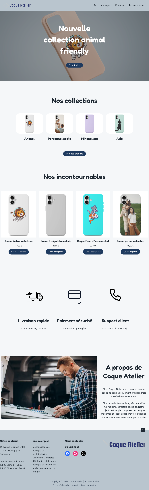

# 🛒 Coque Atelier — Boutique e-commerce

Site e-commerce complet développé sous WordPress/WooCommerce, dans le cadre de mon projet de fin de formation (Ifocop).

## 🌐 Aperçu

## 🧩 Le projet

De la conception visuelle au tunnel d'achat, en passant par la gestion des produits — un projet pensé pour couvrir l'ensemble des étapes de mise en place d'une boutique en ligne fonctionnelle.

## 🛠️ Stack technique

- **WordPress / WooCommerce**
- **HTML / CSS / MySQL**

## 🔗 Liens

- [Site Coque-Atelier](https://coque-atelier.fr/)
- [Portfolio complet](https://moored-parade-bd3.notion.site/Portfolio-d2be2fdf133083b9b0c181154f66d020)

---
